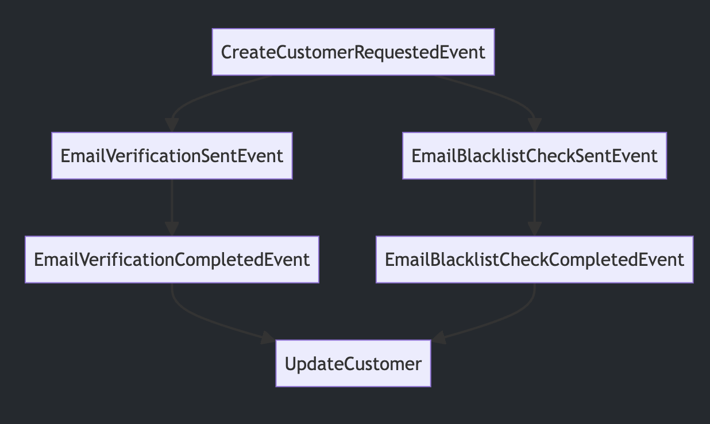

### A simple case

Take the following use case:



We request the creation of a new customer.  At that point, we ask the user to verify their email address.  At the same time, we send the email to be checked against our AML/fraud checker.  At some point, the user verifies their email address and we update the customer record to state that the customer is active.  If the blacklist check fails, we update the customer record to state that the customer is blocked.  Pretty simple.  

Here's our event handlers - they just accept an event and return a new event (or `nil`).

```clojure
(defn verification-email-sender
  [{:keys [type customer-id]} _]
  (case type
    :create-customer-requested
    {:type :email-verification-sent
     :customer-id customer-id}
    nil))

(defn email-blacklist-check-sender
  [{:keys [type customer-id]} _]
  (case type
    :create-customer-requested
    {:type :email-blacklist-sent
     :customer-id customer-id}
    nil))

(defn email-verifier
  [{:keys [type customer-id]} data]
  (case type
    :email-verification-sent
    {:type :email-verification-completed
     :customer-id customer-id
     :verified data}
    nil))

(defn email-blacklist-checker
  [{:keys [type customer-id]} data]
  (case type
    :email-verification-sent
    {:type :email-blacklist-completed
     :customer-id customer-id
     :blacklisted data}
    nil))
```

Note the two functions performing the 'check' operations both accept data.  In the real world, this data would be the result of the check.  In our simulation, we'll just return a random value.

Here's the event handler that updates the customer record:

```clojure
(def customer (atom {}))

(defn customer-repository
  [{:keys [type customer-id email verified blacklisted]} _]
  (case type
    :create-customer-requested
    (swap! customer merge {:customer-id customer-id :email email})
    :email-verification-sent
    (swap! customer assoc :email-status "pending")
    :email-verification-completed
    (when (and verified
               (-> @customer :email-status (not= "blocked")))
      (swap! customer assoc :email-status "active"))
    :email-blacklist-completed
    (when blacklisted
      (swap! customer assoc :email-status "blocked"))
    nil)
  nil)
```

For each event type, it updates the customer record.  If the email is verified and the email status is not blocked, it sets the email status to active.  If the email is blacklisted, it sets the email status to blocked.  We even have a check to ensure that the email status is not set to active if it is already blocked.

So now let's write a test.

```clojure
(defn wrap-handler [handler data]
  (fn [event]
    (handler event data)))


(defspec run-handlers-in-expected-order
  20 ;<-- number of times to run the test
  (prop/for-all
   [verified? gen/boolean      ;<-- generate a boolean to determine if the email is verified
    blacklisted? gen/boolean]  ;<-- generate a boolean to determine if the email is blacklisted
   (let [cmd {:type :create-customer-requested
              :customer-id "123"
              :email "nobody@nowhere.com"} ;<-- the event that starts the process
         all-handlers [(wrap-handler c/email-blacklist-check-sender nil)
                       (wrap-handler c/verification-email-sender nil)
                       (wrap-handler c/email-verifier verified?) ;<-- use the generated boolean to determine if the email is verified
                       (wrap-handler c/email-blacklist-checker blacklisted?) ;<-- use the generated boolean to determine if the email is verified
                       (wrap-handler c/customer-repository nil)]]
     (reset! c/customer {}) ;<-- reset the customer record
     (loop [events [cmd]
            processed-events []]
       (let [new-events (->> all-handlers ;<-- run all the handlers over all the events, returning a collection of new events
                             (mapcat (fn [handler]
                                       (map (fn [event]
                                              (handler event))
                                            events)))
                             (remove nil?))
             new-processed-events (concat processed-events events)]
         (if (empty? new-events)
           (= (expected-customer-email-status new-processed-events) (:email-status @c/customer))
           (recur new-events new-processed-events))))))) ;<-- repeat the process until there are no new events
```

We're using `clojure.test.check` (clojure's [QuickCheck](http://hackage.haskell.org/package/QuickCheck)) to run a property-based test.

This is a pretty good test.  It 
* generates a random value for the email verification and blacklist check on each iteration
* runs all handlers for each event
* receives the output of the handlers and runs them through the handlers again
* repeats until there are no new events
* checks the final state of the customer record against the expected state

```bash
>> clojure -Mkaocha --watch --no-capture-output
[(.)]
{:result true, :num-tests 20, :seed 1715808611266, :time-elapsed-ms 2, :test-var "run-handlers-in-expected-order"}
1 tests, 1 assertions, 0 failures.
```

You can see the test has passed, after running 20 times (`:num-tests 20`).  So we're happy that our event handlers are working as expected, if they run in the order we expect them to.  But things don't run how we expect them to in the real world.  We need to understand how things can go wrong, so we can reduce the chances of that happening at 3am.

### Testing for random execution

Here's our updated test.  It's split into two parts, the spec, and a function that will be run by the spec (you'll see later why).

```clojure
(defn run-handlers-in-random-order
  [verified? blacklisted? events-shuffle-seed handlers-shuffle-seed]
  (let [cmd {:type :create-customer-requested
             :customer-id "123"
             :email "nobody@nowhere.com"}
        all-handlers [(wrap-handler c/email-blacklist-check-sender nil)
                      (wrap-handler c/verification-email-sender nil)
                      (wrap-handler c/email-verifier verified?)
                      (wrap-handler c/email-blacklist-checker blacklisted?)
                      (wrap-handler c/customer-repository nil)]]
    (reset! c/customer {})
    (loop [events [cmd]
           processed-events []
           handler-execution-tracker {}] ;<-- we'll use this to keep track of which handlers have been run for each event
      (let [first-event (first events) ;<-- This time, we're going one event at a time
            [handler updated-tracker event-fully-processed?] (first-handler-from-tracker
                                                              handler-execution-tracker
                                                              first-event
                                                              all-handlers
                                                              handlers-shuffle-seed)
            new-events (->> (when (not event-fully-processed?) first-event) ;<-- if the event has not been run through every handler, we'll keep it
                            (conj [(handler first-event)])
                            (concat (rest events))
                            (remove nil?)
                            (shuffle events-shuffle-seed))] ;<-- reorder the events
        (if (empty? new-events)
          (let [final-processed-events (conj processed-events first-event)
                expected-email-status (expected-customer-email-status final-processed-events)
                actual-email-status (:email-status @c/customer)]
            {:pass (= expected-email-status actual-email-status)
             :expected-email-status expected-email-status
             :actual-email-status actual-email-status
             :final-processed-events final-processed-events}) ;<-- We return a bit more information this time (this will help us in debugging)
          (recur new-events (if event-fully-processed?
                              (conj processed-events first-event)
                              processed-events)
                 updated-tracker))))))
```

The test structure hasn't changed that much, except in a couple of areas:
* We're now going through the events one at a time
* After each event, we shuffle the events
* We also shuffle the order in which the handlers are run for each event

The first test ran in a breadth-first manner (as an event is created, all handlers receive it), which naturally mimics the flow diagram we started with.  This test, however, runs in a random order - it could be breadth-first, depth-first, or in-between.  This is a more realistic test of how the system could behave in the real world.

```clojure
(defspec run-handlers-in-random-order-spec
  (prop/for-all [verified? gen/boolean
                 blacklisted? gen/boolean
                 events-shuffle-seed gen/large-integer
                 handlers-shuffle-seed gen/large-integer]
                (-> (run-handlers-in-random-order verified? blacklisted? events-shuffle-seed handlers-shuffle-seed)
                    :pass)))
```

Importantly, the spec now generates seeds for our shuffle function (below).  This means that, while the order of events is random, it is repeatable.  

```clojure
(defn shuffle [seed coll]
  (let [r (Random. seed)
        a (ArrayList. coll)]
    (Collections/shuffle a r)
    (vec (.toArray a))))
```

We can now run the test.

```bash
FAIL in core-test/run-handlers-in-random-order-spec (core_test.clj:109)
expected: {:result true}
  actual: {:shrunk {:total-nodes-visited 36, :depth 5, :pass? false, :result false, :result-data nil, :time-shrinking-ms 6, :smallest [false true -511 -2]}, :failed-after-ms 13, :num-tests 17, :seed 1715809825215, :fail [true true -731 -2], :result false, :result-data nil, :failing-size 16, :pass? false, :test-var "run-handlers-in-random-order-spec"}
2 tests, 2 assertions, 1 failures.
```

Our new test fails.  By default, the runner iterates 100 times, but we can see that it failed after 17 iterations (`:num-tests 17`).  More importantly, we can see what input values were being used when the test failed (`:fail [true true -731 -2]`).  We can use these values to debug the test.

```bash
core-test=> (run-handlers-in-random-order true true -731 -2)
{:pass false, :expected-email-status "blocked", :actual-email-status "active", :final-processed-events [{:type :create-customer-requested, :customer-id "123", :email "nobody@nowhere.com"} {:type :email-blacklist-completed, :customer-id "123", :blacklisted true} {:type :email-verification-sent, :customer-id "123"} {:type :email-verification-completed, :customer-id "123", :verified true} {:type :email-blacklist-sent, :customer-id "123"}]}
```

Let's look at that data we returned from our separate test function.

```clojure
{
  :pass false,
  :expected-email-status "blocked",
  :actual-email-status "active",
  
  :final-processed-events
  [
    {:type :create-customer-requested,
     :customer-id "123",
     :email "nobody@nowhere.com"}

    {:type :email-blacklist-completed,
     :customer-id "123",
     :blacklisted true}

    {:type :email-verification-sent, :customer-id "123"}

    {:type :email-verification-completed,
     :customer-id "123",
     :verified true}

    {:type :email-blacklist-sent, :customer-id "123"}]}
```

We expected the email to be blocked, but it was active.  Why?  Let's look at the events that were processed by our customer-repository.

* First, the creation of a customer
* Then the blacklist event completed; the email was blacklisted, so we set the email status to blocked
* We then sent the email for verification.  The email status is set to pending.
* We receive email verification.  The email status is set to active.

So, because we assumed the sending of the email verification would be seen *before* the blacklist check returned, we didn't bother checking the status.  That's our bug.


 
