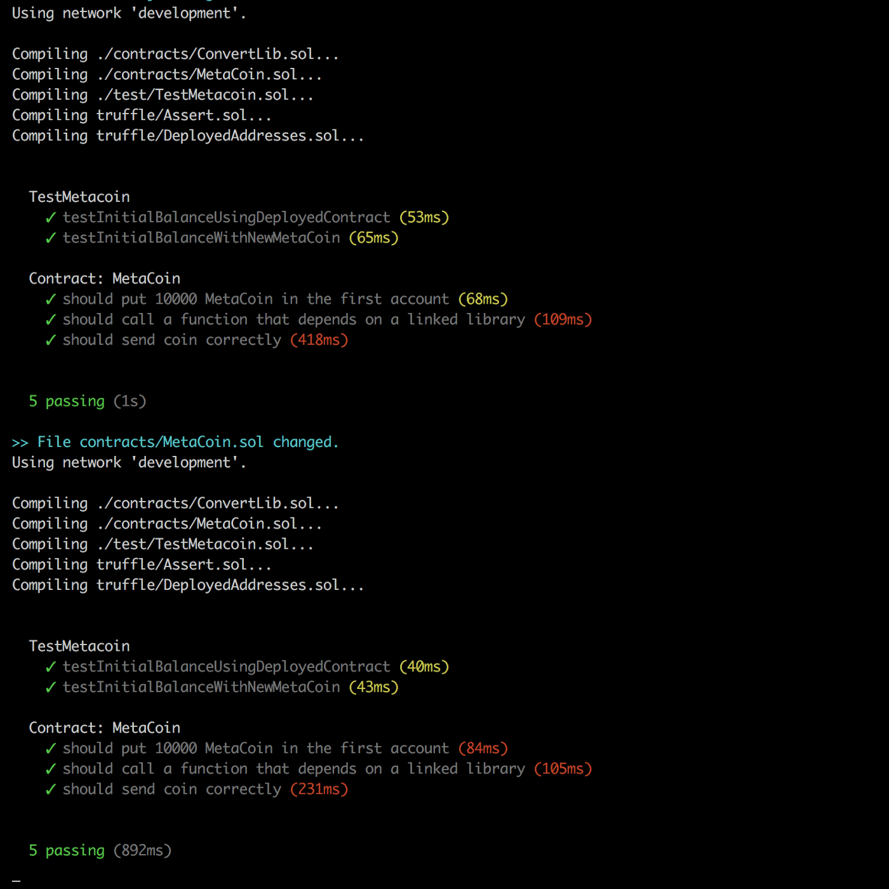

Developing smart contracts on Ethereum is pretty new to me, so I was ecstatic when I found truffle, a smart contract and DApp development environment, written in javascript on node, a platform I’m pretty familiar with. Tim Coulter, Consensys and the other contributors have outdone themselves creating such a professional and easy to use tool. Like all OS projects though, as it attracts more people, it’s going to become more of an issue to maintain, and more of us are going to need to chip in. For someone who is not familiar with node, this is going to be an irritation. So here’s how I went about creating a PR to add a feature I wanted.

### The feature

Truffle already has a `test` command (run all tests) and a `watch` command (watch for file changes and rebuild my app), but I like my workflow to combine the two - watch for when I save files and automatically run the tests.

### The problem

If you’ve been working with truffle you’ll know that you install truffle with `npm install -g truffle` which gives you a set of commands to run. But how can you change those commands? How do you get your changes back into the project to be used by others?

### The plan

Here’s what we’re going to do:

-   Fork the `truffle-core` project in github
-   Clone our fork to a local repository
-   Verify the project
-   Create a new branch that describes the problem
-   Make our changes
-   Test them out
-   Create a pull request with our new code

### Fork!

Many people will be able to skip this section (and the next), but if you’re not familiar with github and pull requests, you’re going to want to sign up with github, navigate to [https://github.com/trufflesuite/truffle-core](https://github.com/trufflesuite/truffle-core), and click the `Fork` button. You now have a copy of this project at `https://github.com/<username>/truffle-core`. Congratulations!

### Clone!

If you have `git` installed, you'll want to go to your projects directory and `git clone https://github.com/<username>/truffle-core` at this point and change into the directory it creates. If you'd prefer a GUI, you can install the github desktop client, gitkraken sourcetree and click on the 'Open in desktop' button on `https://github.com/<username>/truffle-core`.

### Verify!

Before continuing, you need to install the dependencies (`npm install`) and make sure everything is as it should be by running the project tests (`npm test`)

### Branch!

We’re now going to create a branch that describes what we’re trying to do. This branch will live until our code is accepted. It will have the initial changes, but it might also have some updates because we found a bug or the reviewer asked it to be changed. I’m calling mine `269_watch_tests` (269 is the issue people raised because they wanted this feature).

git checkout -b 269_watch_tests

If you’re using the GUI, there’s going to be a branch button in there somewhere…

### Change!

Hm. This bit is your problem. You need to know that the entry point is `cli.js`.

### Test!

First run `npm test` again. If tests now fail, you've broken it and you're going to need to fix it. If you haven't (congrats!) you need to test that the changes you've made _actually work_.

For this step we’re going to link _your_ version of truffle with a new project and go through the steps to initialise and run the project. In your truffle core project

```
npm link
```
This is going to allow you to use your project from an npm project you’re about to create. From your projects directory:
```
> mkdir test   
> cd test   
> npm init (accept all the defaults - it doesn't matter for our use case)   
Is this ok? (yes) > npm link truffle-core   
test/node_modules/truffle-core -> ~/.nodebrew/node/v7.10.0/lib/node_modules/truffle-core -> ~/truffle-core
```
Okay, now you have a new project linked to your truffle-core, let’s try using it:
```
> node_modules/truffle-core/cli.js init   
Downloading project...   
Installing dependencies...   
Unhandled rejection No packages found   
Project initialized.   
Documentation: http://truffleframework.com/docs Commands:   
Compile: truffle compile   
Migrate: truffle migrate   
Test: truffle test
```
Yay! Now I’m going to try out my new command.
```
> node_modules/truffle-core/cli.js watch --network=development --tests
```

Perfect! Let’s get this code into a pull request.

git add lib/commands/watch.js   
git commit -m "Add --tests flag to watch"   
git push origin 269_watch_tests

The last step is to go to your `https://github.com/<username>/truffle-core` and click 'Open pull request'.

Congratulations - you have now moved the entire community forward a tiny increment.