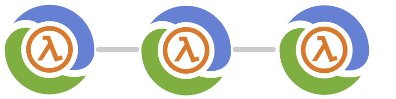

A few months ago I started on a project I called [events unbundled](https://github.com/p14n/events-unbundled).  It's an experiment into how far we can really separate the core logic of a system from the infrastructure it lives in (its also a hat-tip to [unbundling the database](https://martin.kleppmann.com/2015/03/04/turning-the-database-inside-out.html) ).  I take the core code (a simple customer signup) and try and deploy it in multiple architectures, *without* changing the original code, just the shell around it.  A recent iteration tested deploying this event-sourced, command/query separated app into a serverless architecture on AWS.  I thought this was interesting enough for me to share in its own post.


### The design

The main reason for using this implementation was cost - I wanted to see if it was possible to have a system that, when not used, cost $0.  This means restricting my choices to the list of [AWS serverless products](https://aws.amazon.com/serverless/) (Aurora is actually also excluded because running costs are incurred).  Dynamodb streams always seemed like a good fit, but the response correlation aspect stumped me for a while - I was trying to use req/res with SQS; a job it's entirely unsuitable for.

The final design can be seen here


* Query/mutation - API gateway provides the public http interface to the graphql lambda
* Command - The [Apollo Server](https://www.apollographql.com/docs/apollo-server/) runs as a lambda and turns mutations into commands (mutation name becomes command type, input payload becomes the command body), which it then writes to dynamodb.  All events are written to the same table; with a specific topic (ie `commands` or `customer`) and a type of event (ie "InviteCustomer")
* Command/event stream - DynamodDB streams take the newly inserted commands/events and forward them to Event Bridge
* Listeners - The connection between the stream and the lambdas is implemented using Event Bridge listener rules - there is a rule for each topic, and a rule target for each lambda listening to that topic, so we get the fan-out behaviour we need
* Event/update - some lambdas will take an event and create a new event, some (maybe the same) will write their own data, either for a domain-local record or to provide a projection/view for queries
* Notification - Each lambda sends a notification on Elasticache redis to indicate its work is complete.  
* Correlate responses - This notification is picked up by the apollo lambda invocation, which uses some core code to wait for the right set of circumstances to indicate the original request has been completed.
* Query - When a query (as opposed to a mutation) is sent, or when a mutation has completed, the apollo server performs the query using the supplied resolver to fulfil the request.

### The code

The work in `events-unbundled` is in clojure.  So far it's all been done on the JVM.  For this serverless architecture, I wanted to avoid the JVMs cold startup time, so I used [nbb](https://github.com/babashka/nbb), a clojure interpreter for nodejs, which was an absolute joy.  The original clojure code was used to provide the core functionality, with supporting infrastructure in clojurescript.  The topology comes from the metadata in the original code:

```clojure
(def invite-customer
  ^{:in [:commands] :out :customer :name :invite-customer-event-handler}
  (fn [{:keys [event-notify-ch]}
       {:keys [email type]}
       {:keys [existing-id]}]
    (case type
      :InviteCustomer
      (if (empty? email)

        (event-notify-ch {:type :error
                          :message "Email is required"})

        (if existing-id
          (event-notify-ch {:type :CustomerInviteFailed
                            :customer-id existing-id
                            :reason "Customer already invited"})

          {:event-id (cc/uuid)
           :type :CustomerInvited
           :customer-id (cc/uuid)
           :email email}))
      nil)))
  ```

You can see the implementation of the resolvers (handlers that fulfill the graphql schema) below.  The single query is a simple lookup, the mutation writes a command, which I'll come to next.

```clojure
(def type-defs
  "type Customer {
     id: ID!
     email: String
     invited: Boolean
   }
   type Query {
     Customer(id: ID!): Customer
   }
   type Mutation {
     InviteCustomer(email: String): Customer
   }
   schema {
     query: Query
     mutation: Mutation
   }")
(def resolvers
  {:Query {:Customer (fn [c a v]
                       (js/console.log c a v)
                       (let [{:keys [id]} (shell/js->kwclj a)]
                         (-> (ddb/single-item-fetch (ddb/create-client) "customers" {"id" {"S" id}})
                             (.then #(clj->js %)))))}

   :Mutation {:InviteCustomer (fn [c a v]
                                (js/console.log c a v)
                                (shell/write-command "InviteCustomer" (shell/js->kwclj a) {}
                                                     (r/invite-responder
                                                      (fn [db id] (ddb/single-item-fetch db "customers" {"id" {"S" id}})))))}})
```

The `write-command` function is the key to the system.  It writes a command to the dynamodb table, and then waits for a notification that the command has been processed.  The notification is sent by the lambda that processed the command, and is picked up by the apollo server lambda.  The `invite-responder` function is a callback that is called when the command has been processed, and is used to fetch the result of the command (in this case, the customer record).

```clojure
(defn write-command [command-name body init-ctx resolver] (js/console.log "Starting command" command-name body)
  (let [id (core/uuid)
        _ (js/console.log "Writing command" id command-name (clj->js body))
        command (-> body
                    (assoc :type command-name :event-id id)
                    (ddb/create-event-record "commands"))
        db-client (ddb/create-client)
        ctx (assoc init-ctx :db db-client)
        response-promise (subscribe-response id ctx resolver)]
    (-> (.all js/Promise
              [response-promise
               (ddb/write-all-table-requests db-client [(ddb/create-table-put-requests "events" [command])])])
        (.then #(first %)))))
```

The `invite-customer` function above is the handler for the `InviteCustomer` command.  We tie the function to the infrastructure implementation like this:

```clojure
(clj->js {(s/handler-name-kw h/invite-customer) (s/create-lookup-writer-handler h/invite-customer invite-customer-lookup create-customer-email)
          (s/handler-name-kw p/project-customer) (s/create-lookup-writer-handler p/project-customer customer-lookup update-customer)})
```

The meat of the handler implementation is a general function that takes a handler and a lookup function, and returns a lambda that will call the handler with the event, the lookup function and the event-notify channel.  The lookup function is used to fetch the current state of the domain object (in this case, the customer record) so the handler can make decisions based on the current state.

```clojure
(defn create-handler [handler-func lookup-func writer-func]
  (fn [e _ctx]
    (js/console.log "Event received " e)
    (p/let [db-client (ddb/create-client)
            q-client (create-redis-client)
            event (translate-event e)
            correlation-id (:correlation-id event) ; <-- The correlation id is used to match the response to the request
            out-topic (handler-topic handler-func) ; <-- The topic to write the result to comes from the metadata
            event-notify-ch (create-event-notify-ch correlation-id) ; <-- A function that will send a notification to the apollo lambda over Elasticache
            ctx {:event-notify-ch event-notify-ch :db db-client}

            lookup-data (if lookup-func (lookup-func ctx event) {})
            _ (js/console.log "Lookup " (pr-str lookup-data))
            handler-output (handler-func ctx event lookup-data) ; <-- Invite customer handler is called
            result (some-> handler-output
                           (assoc-if :correlation-id (when out-topic correlation-id)))
            _ (js/console.log "Result " (pr-str result))
            writer-req (when writer-func
                         (writer-func ctx result))
            table-requests (when result ; <-- We write the result to the events table, along with any other information written by the writer function
                             (->> [writer-req
                                   (when out-topic
                                     (ddb/create-table-put-requests "events" [(ddb/create-event-record result out-topic)]))]
                                  (remove nil?)
                                  (vec)))
            _ (js/console.log "Table requests " (pr-str table-requests))
            write-response (when (seq table-requests)
                             (ddb/write-all-table-requests db-client table-requests))
            _ (js/console.log "Write response " (pr-str write-response))]
      (event-notify-ch (meta writer-req))
      (event-notify-ch result)
      (.unref q-client)
      (.destroy db-client)
      (http-response 200 result))))
```

The full code is [here](https://github.com/p14n/events-unbundled/tree/main/projects/aws-serverless)

### Challenges
* I spent a lot of time (mainly hammock time) ruling out SQS:
  * There is no way to create temporary queues to implement a req/res pattern
  * Without a dedicated queue any listener will steal all messages (it can return them but after a delay)
* The use of Elasticache (VPC) with Lambda and DynamoDB (public network) mandated moving the Lambda's into a VPC and using a VPC endpoint for DynamoDB. This works fine, but was fiddly to get right.
* Lambdas relying on async actions are very difficult to debug when they go wrong

### Performance
The graphql query response is okay - roughly 100ms to start, read a value from DynamoDB and return the request. Mutation response takes seconds due to the multiple messages via DynamoDB/Event Bridge. The timings from a typical (not cold) start look like this:

```
Start request
Lambda started and command sent (217ms)
Handler fires (517ms)
Projector fires (905ms)
Waiting for all downstream results (2.413s)
Load and return result (28ms)
```
The entire request took 2712ms, but only 1667ms was spent in the lambdas, so ~1 seconds has gone to message passing in DynamoDB/EventBridge/Elasticache. I spent no time improving or analysing this performance; tracing would be needed to really understand where to make improvements.

### Conclusion
From a developer experience point of view, this is a win.  Adding new clojure functions to handle different events is fairly trivial now the shell has been written.  It also fulfilled the main objective of not changing the original clojure code.  From a functional point of view, however, I'd say this zero-cost design has limited use cases - the tradeoff in performance and complexity doesn't seem worth it when compared to the previous implementations.  The project can be found [here](https://github.com/p14n/events-unbundled/tree/main/projects/aws-serverless) and the infrastructure in this [tf.json](https://raw.githubusercontent.com/p14n/events-unbundled/main/projects/aws-serverless/infra/serverless.tf.json) (Clojure code generates this, not HCL)

  